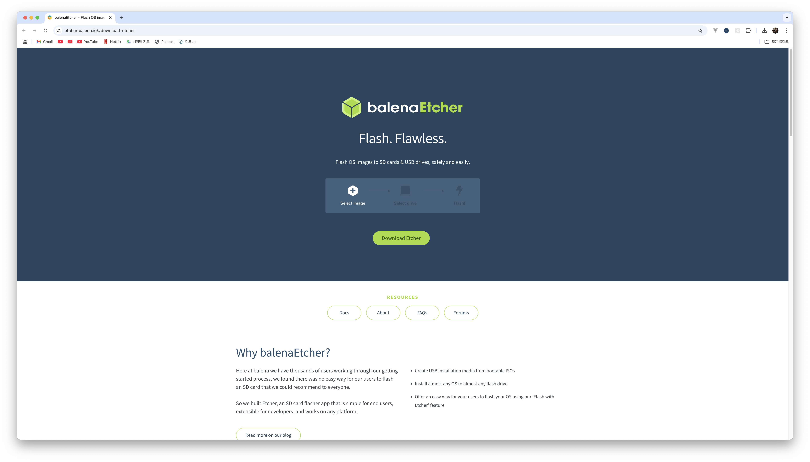
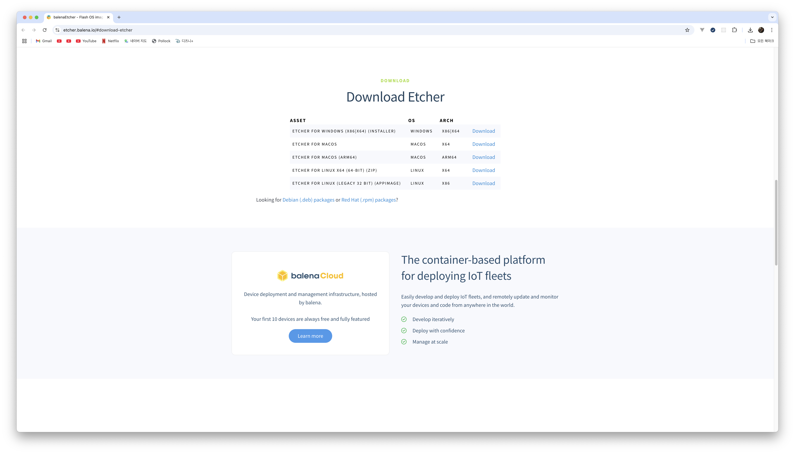
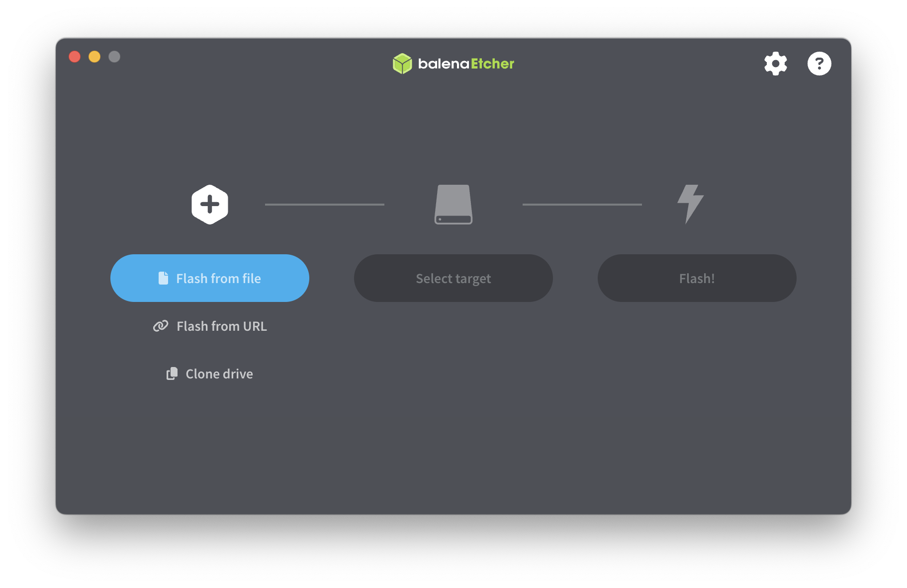
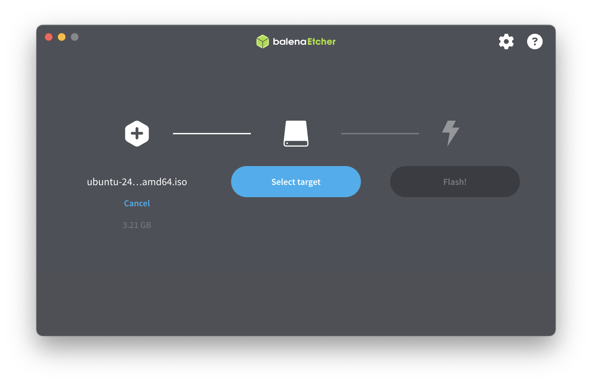
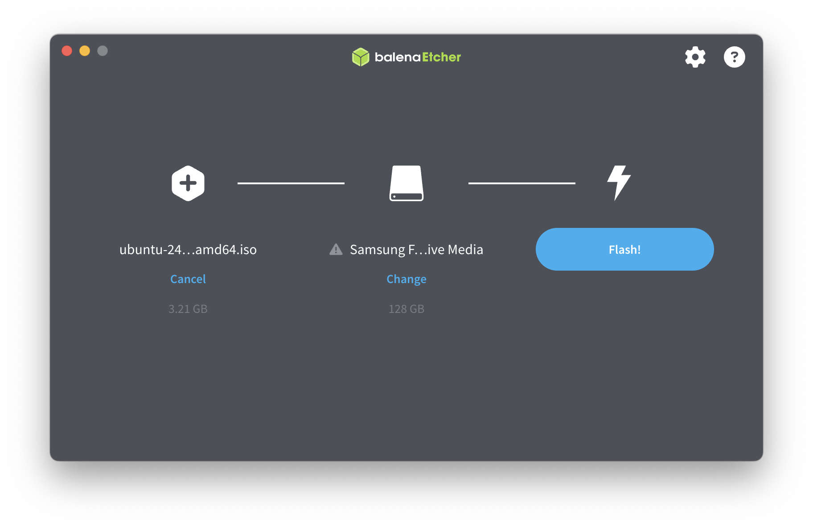
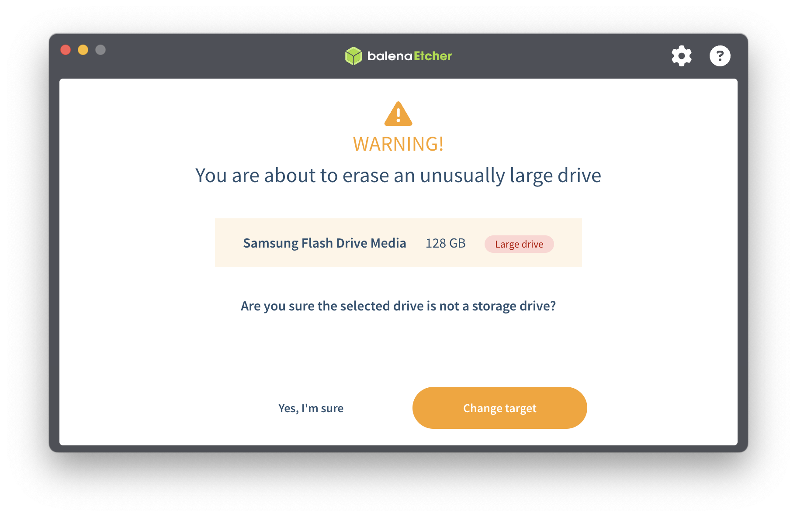
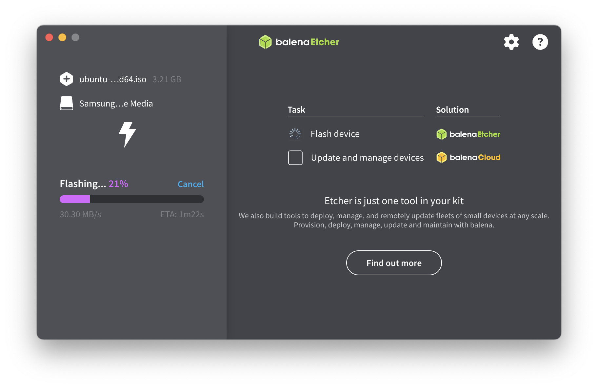
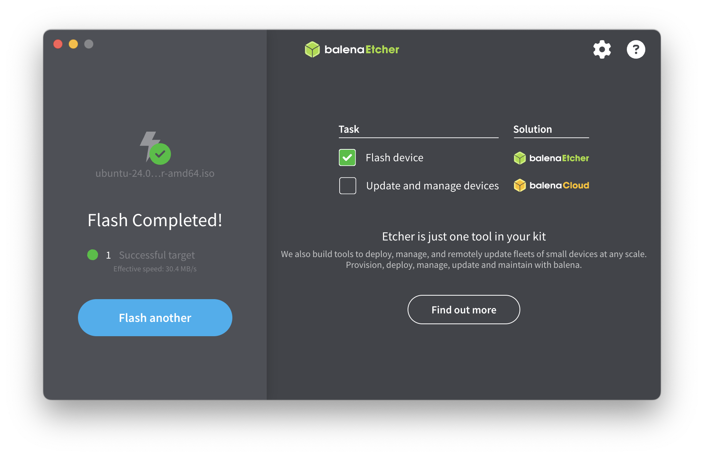
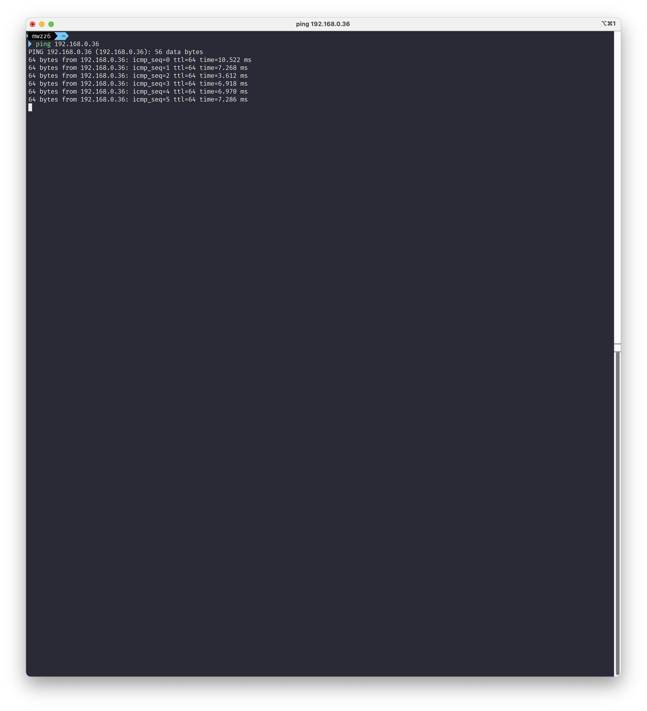

# 미니PC에 리눅스 우분투 설치하기

## 목차

- [소개](#소개)
- [리눅스 우분투 ISO 파일 다운로드](#리눅스-우분투-iso-파일-다운로드)
- [balenaEtcher로 부팅 USB 만들기](#balenaetcher로-부팅-usb-만들기)
- [리눅스 우분투 설치](#리눅스-우분투-설치)
- [통신 테스트](#통신-테스트)

---

## 소개

홈 서버를 구축하며 인프라, 리눅스, 네트워크 등에 대해 좀 더 심도있게 공부하고 AWS 비용도 절약할겸 미니PC를 통해 홈 서버를 구축해보기로 했다. 공간 차지를 덜한다는 점에서 미니PC와 라즈베리파이가 후보에 있었는데 라즈베리파이 가격도 제법 나가서 그냥 완제품으로 나오는 미니PC를 선택했다. 저전력 CPU인 Intel N100, RAM은 혹시 모자랄 수 있을까봐 16GB인 미니PC 중 백도어 프로그램 이슈가 없었으면서 사람들이 많이 추천하는 모델을 찾았고 최종적으로 Chatreey의 미니PC를 선택했다.(15만원어치 뽕을 뽑아야한다...)

> Chatreey T9 미니 PC(Intel N100, RAM 16GB, SSD 512GB, Windows 11)

개발 환경은 M3 맥북 에어를 활용했으며 리눅스 우분투 설치를 위한 USB, 모니터, 키보드가 필요했고 공유기에 랜선 연결까지 해준 채로 진행했다.

---

## 리눅스 우분투 ISO 파일 다운로드

리눅스의 대표적인 배포판인 우분투를 OS로 선택했다. IT 자산 관리 기업 Lansweeper의 [2024년 리눅스 배포판 점유율 자료](https://www.lansweeper.com/blog/eol/centos-linux-end-of-life/)에서 우분투의 점유율이 32.24%로 가장 높기도 했고 SSAFY 팀 프로젝트에서 동료들도 모두 우분투를 선택했다는 점에서 큰 고민 없이 우분투를 선택했다.

https://ubuntu.com/download/server 에서 `Ubuntu 24.04.2 LTS` 파일로 다운로드를 해줬다. `Ubuntu 22.04.5 LTS`도 많이 사용하는 안정적인 OS로 보였는데, 호환성을 크게 고려할 필요없는 첫 서버이면서 학습용 서버이기도 하고 출시된지 15개월 정도 지났으니 한번 사용해보기로 했다. `SSH`가 주 사용 환경이라 GUI 환경이 필요없고 미니PC 사양도 낮으므로 `Ubuntu Server`로 설치했다.

---

## balenaEtcher로 부팅 USB 만들기

우분투 ISO 파일 다운로드가 끝났으면 부팅 USB를 만들어줘야 한다. macOS에서 GUI로 쉽게 부팅 USB를 만들 수 있는 `balenaEtcher`를 활용했다. 우분투 ISO 파일이 3GB 정도 되므로 부팅 USB는 8GB 이상은 되는 걸로 선택하고 내부에 파일이 있으면 삭제되니 미리 백업을 해줘야 한다.

https://etcher.balena.io 에서 부팅 USB를 만드려는 OS와 CPU 아키텍처에 맞는 파일을 받아주면 된다. M3 맥북 에어로 부팅 USB를 만드려고 해서 MACOS, ARM64를 선택해줬다.

`balenaEtcher`를 실행한 후 `Flash from file`에서 Flash할 파일로 우분투 ISO 파일을 선택하고,

`Select target`에 부팅 USB를 선택하고,

`Flash!`를 누르고,

`Yes, I'm sure`로 부팅 USB를 구워주면 된다.(USB 파일 삭제 주의)

부팅 USB 굽기가 진행되고,

2분정도 걸려서 부팅 USB 만들기가 끝났다.

---

## 리눅스 우분투 설치

미니PC에 리눅스 우분투를 설치하려면 미니PC를 종료한 상태에서 부팅 USB를 꽂고 전원을 켠 후 BIOS에 진입해야 한다. 제조사별로 다른데 `Chatreey T9`은 ESC를 연타하면 진입이 됐다. 이후 진행은

- BIOS에서 `Boot` 메뉴로 이동 후 `Boot Option`에 부팅 USB가 `#2`, `Windows Boot Manager`가 `#1`로 되있는 거 확인
- `Boot Option #1`을 부팅 USB로 변경
- `Save & Exit` 메뉴로 이동 후 `Save Changes and Exit`으로 저장
- 부팅 USB 빼기

미니PC가 검은 화면에 흰 글씨로 켜지면 이제 우분투 서버를 설치하면 된다. `Try or Install Ubuntu Server` 선택 후 계속 기본 옵션을 선택해주다가 `Profile configuration`에서 프로필 설정을 해주면 된다. 나는 서버 이름은 `bobo-01`, 유저 이름은 `mwzz6`으로 설정해줬다. 다시 쭉 기본 설정을 해주다가 `Ubuntu 24.04.2 LTS bobo-01`이 나왔을 때 프로필 설정에서 입력한 유저 이름과 비밀번호로 로그인하니 우분투 서버 설치에 성공했다.

---

## 통신 테스트

이제 맥북과 미니PC가 서로 통신이 되는지 `ping` 명령어로 테스트를 해줬다. 맥북은 공유기에 와이파이로, 미니PC는 공유기에 랜선으로 연결되어 있어서 같은 내부 네트워크라 잘 통신이 될 것으로 예상했다.(별도의 서브넷 분리를 안했다면)

맥북의 IP 주소는 맥북 터미널에서 `ifconfig`, 미니PC의 IP 주소는 미니PC 터미널에서 `hostname -I`로 확인 가능하다. 맥북의 IP 주소는 `192.168.0.33`, 미니PC의 IP 주소는 `192.168.0.36`으로 나왔다.

맥북에서 미니PC로 `ping`이 잘 보내졌고, 미니PC에서 맥북으로 `ping`도 잘 보내져서 서로 통신이 잘 되는것으로 확인했다.

---
