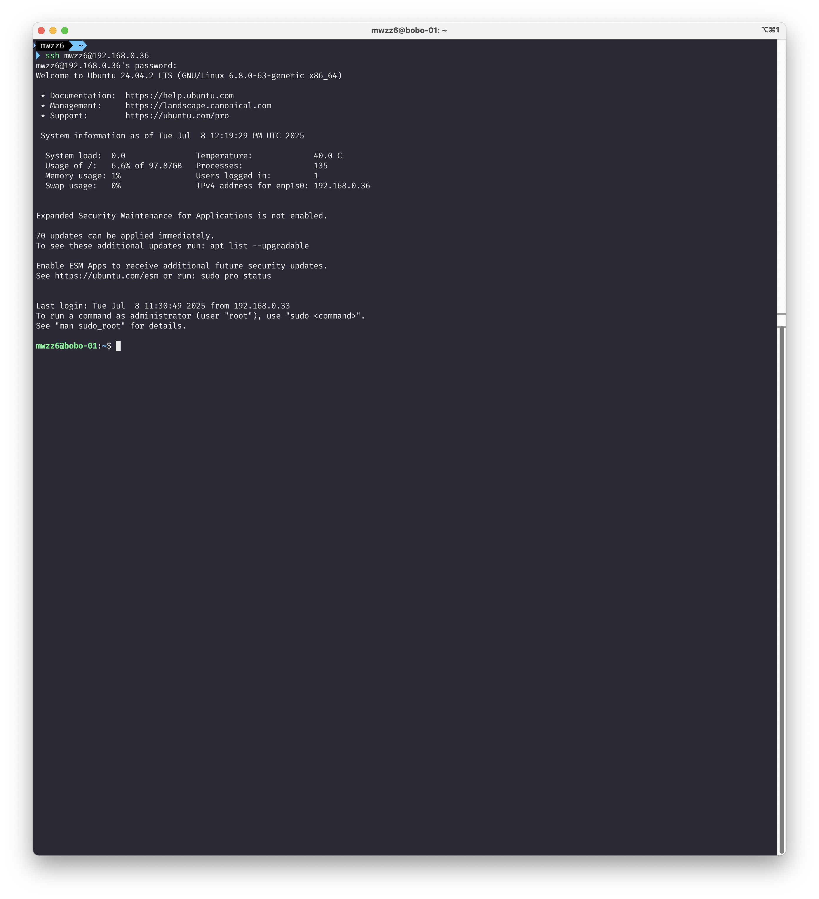
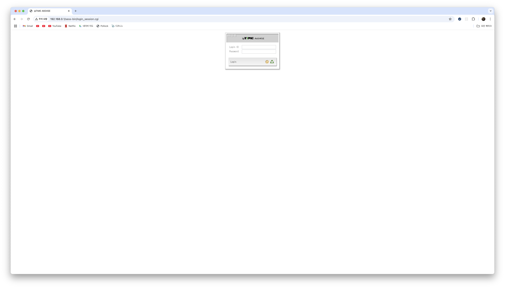
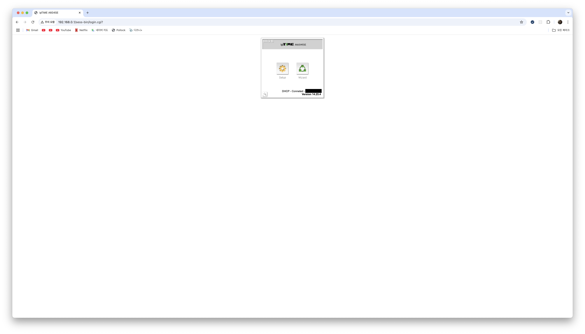
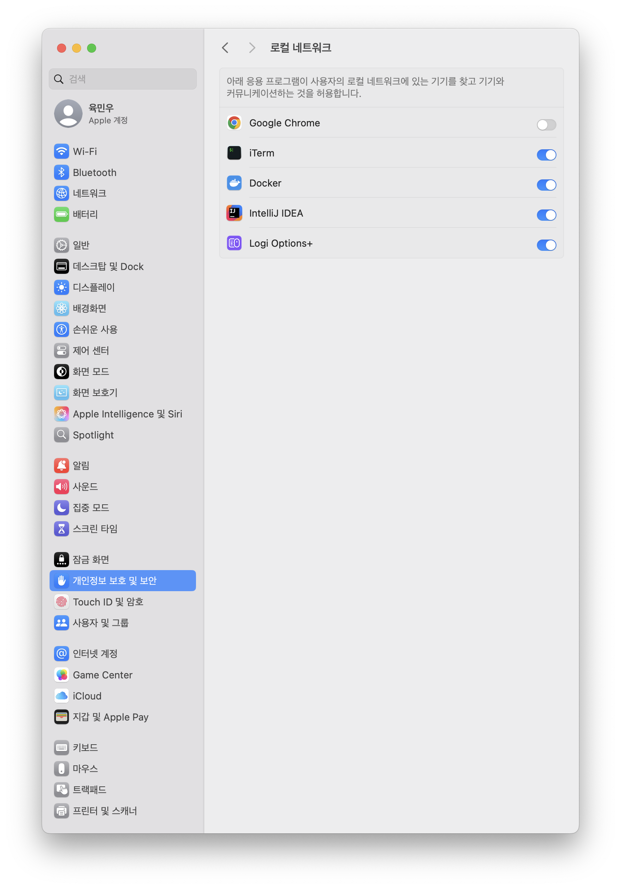
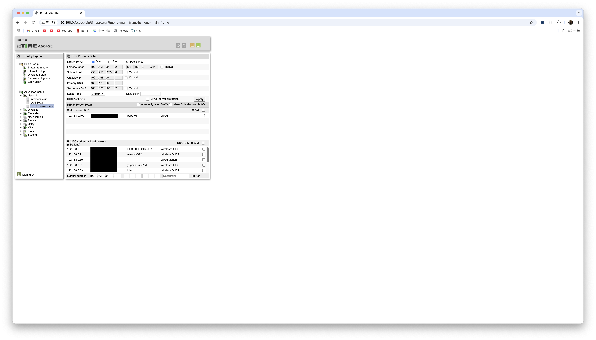
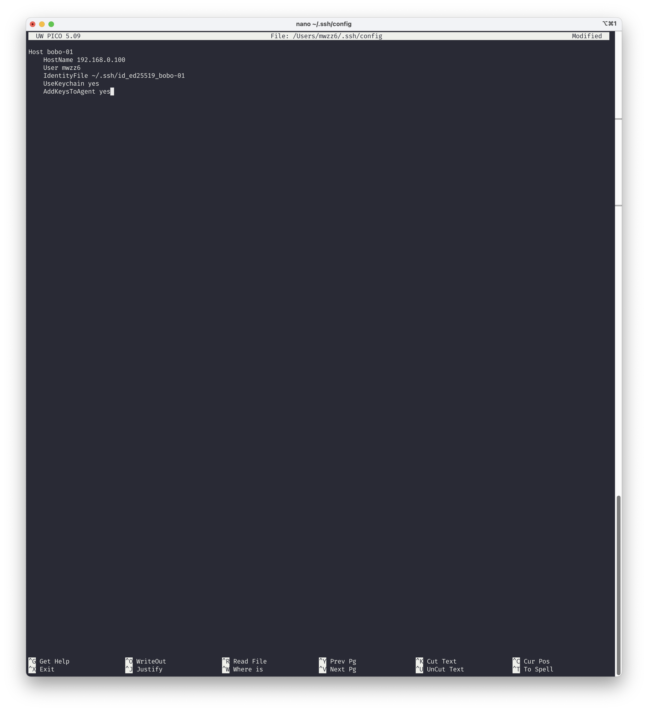

# SSH 연결 설정하기

## 목차

- [소개](#소개)
- [SSH 연결해보기](#ssh-연결해보기)
- [사설 IP 고정하기](#사설-ip-고정하기)
- [SSH 키 설정하기](#ssh-키-설정하기)
- [SSH 키 설정하기 2](#ssh-키-설정하기-2)
- [비밀번호 인증 비활성화](#비밀번호-인증-비활성화)

---

## 소개

미니PC는 24시간 돌아가는 홈 서버로 사용할 예정이고 이 홈 서버는 맥북을 통해 관리를 할 예정이다. 맥북에서 홈 서버에 접속해서 여러 조작을 하기 위해서 `SSH`를 활용할 예정이고 이와 관련된 여러 설정을 해줄 예정이다.

`SSH`는 `Secure Shell`의 줄임말로, 원격 호스트에 접속하기 위해 사용되는 보안 프로토콜이다.(`Shell`은 명령어와 프로그램을 사용할 때 쓰는 인터페이스로 검은 바탕에 흰 글자가 나오는 명령어 입력 환경을 떠올리면 된다.) 기존에는 `Telnet`이라는 방식을 사용했는데 암호화를 제공하지 않는다는 보안상 단점이 있어서 현재 원격 접속 보안을 위해 `SSH`를 필수적으로 사용한다. `SSH`는 비대칭키를 통해 서로 인증을 하고 대칭키를 통해 암호화된 통신을 진행한다.

Ref

- https://library.gabia.com/contents/infrahosting/9002
- https://library.gabia.com/contents/9008

---

## SSH 연결해보기

우분투 설치 과정에서 `SSH` 설치를 진행했다면(기본 설정값) 아래 명령어로 `SSH`로 원격 접속을 해볼 수 있다.

```bash
ssh mwzz6@192.168.0.36  # ssh [사용자이름]@[서버 IP]
```



쉘이 `mwzz6@bobo-01`로 바뀐 것을 통해 `SSH` 접속이 잘됨을 볼 수 있다.

---

## 사설 IP 고정하기

현재 공유기 내 같은 내부 네트워크에서 홈 서버의 사설 IP를 통해 `SSH` 원격 접속을 하고 있는데 이 사설 IP는 공유기에서 `DHCP`를 통해 동적 할당을 받고 있으므로 추후 바뀔 수도 있는 것으로 생각됐다. `DHCP` 서버인 공유기 설정을 통해 먼저 홈 서버의 사설 IP를 항상 일정하게끔 고정시켜줘서 추후 서비스 운영 과정에서 `SSH`, `포트 포워딩`, `리버스 프록시` 등이 원활하게 되도록 해줬다.

크롬 브라우저에서 `192.168.0.1`로 공유기 관리자 페이지로 접속해서 로그인을 해줬다. 공유기는 `ipTIME A604SE`를 사용중이다.




공유기 관리자 페이지 접속이 안되면 터미널에서 `route get default` 명령어로 나온 gateway IP 주소로 접속 시도를 해보고, 크롬 브라우저만 안되고 사파리 등 다른 브라우저는 된다면 macOS에서 크롬 브라우저의 로컬 네트워크 설정이 허용되어 있는지 확인해보자(이거 찾는데 2시간 걸렸다...)




DHCP Server Setup에서 홈 서버의 사설 IP를 `192.168.0.100`으로 `static DHCP` 설정을 해줬다.




저장하고 홈 서버를 재시작하면 기존 IP 주소로는 접속이 안되고 새로운 사설 IP 주소로는 잘 접속되는걸 볼 수 있었다.


---

## SSH 키 설정하기

현재 `SSH`는 기본 설정인 비밀번호로 접속한 사용자 인증을 하는 상황인데 이를 비대칭키 기반으로 바꿔서 보안을 좀 더 향상할 수 있다. 맥북에서 공개키 개인키 쌍을 생성하고 공개키를 서버로 전달하면 `SSH` 접속 시 이를 통해 안전하게 접속할 수 있다. `SSH` 키는 브루트 포스 공격으로는 뚫을 수 없어 비밀번호 방식보다 안전하지만 개인키 분실에 주의해야한다.

맥북 터미널에서 `ssh-keygen -t ed25519 -f ~/.ssh/id_ed25519_bobo-01 -C "bobo-01-server"`로 공개키 개인키 쌍을 생성하고 `ssh-copy-id -i ~/.ssh/id_ed25519_bobo-01.pub mwzz6@192.168.0.100`으로 서버에 공개키를 전달했다.(개인키를 전달하면 안된다.)

이러면 이제 `ssh -i ~/.ssh/id_ed25519_bobo-01 mwzz6@192.168.0.100`로 `SSH` 키를 통해 접속할 수 있다.
개인키에 `passphrase` 설정을 할 경우 개인키 비밀번호도 입력을 해줘야 한다.

---

## SSH 키 설정하기 2

`SSH` 키를 통해 `SSH` 원격 접속을 하는 것은 좋은데 뭔가 불편한 점이 많았다. 일단 저 `SSH` 키를 매번 포함해서 접속 요청을 보내는 것도 불편하고 사설 IP를 매번 입력하는 것도 불편하고 개인키 비밀번호를 매번 입력하는 것도 불편하다.(개인키 비밀번호 설정을 안했으면 넘어가도 된다) 이점을 해결해보았다.

간편한 `SSH` 접속을 위해 `~/.ssh/config` 파일을 통해 `SSH` 접속 설정을 해주었다. `nano ~/.ssh/config`로 다음과 같이 작성해주었다.



이 파일을 통해 이제 `ssh bobo-01`만으로 서버에 접속할 수 있어졌다. 하지만 여전히 개인키 암호는 입력해줘야 한다.

```bash
ssh-add --apple-use-keychain ~/.ssh/id_ed25519_bobo-01
```

해당 명령어로 macOS 키체인을 통해 비밀번호 입력 없이 SSH 접속을 할 수 있다.


모든 설정을 마치면 위처럼 `ssh bobo-01`로 간단하게 `SSH` 접속을 할 수 있다.

---

## 비밀번호 인증 비활성화

이제 `SSH` 키로 `SSH`이 접속이 가능하므로 비밀번호를 통한 접속을 하지 못하게 막아줘야 한다.

`SSH` 키로 원격 접속 후 `sudo nano /etc/ssh/sshd_config.d/50-cloud-init.conf`에서 `PasswoarAuthentication`을 `no`로 바꿔주고 `sudo systemctl restart ssh`로 `SSH` 서버를 재시작해주면 된다. 이제 `SSH` 키로만 접속을 할 수 있게 되어 더욱 안전해졌다.

---
