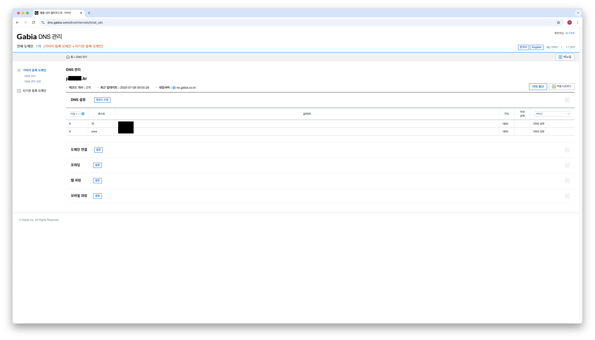

# DNS, DDNS 설정하기

## 목차

- [소개](#소개)
- [DNS 설정하기](#dns-설정하기)
- [DDNS 설정하기](#ddns-설정하기)

---

## 소개

공인 IP와 포트 포워딩을 통해 홈 서버의 웹 서버에 잘 접근할 수 있지만 매번 공인 IP를 통해 접근하는 것은 불편한 점이 많다. 사람이 기억하기 쉬운 이름을 통해 웹 서버에 접근할 수 있게 `DNS` 설정을 해주면 서비스를 대표하는 도메인 네임으로 서비스에 접근할 수 있게 된다. 추가로 공유기의 `DHCP` 동적 할당 등을 통해 바뀔 수 있었던 사설 IP처럼 공인 IP 역시 고정해주지 않으면 바뀔 수 있는데 이 경우 홈 서버에 다시 접근할 수 없게 된다. 공인 IP를 고정하는 것은 비용 문제가 있기 때문에 동적으로 변할 수 있는 공인 IP를 찾게 해주는 `DDNS`를 이용해 안정적으로 웹 서버를 이용할 수 있게 설정하는 것을 연습하려고 한다.

---

## DNS 설정하기

DNS는 도메인 이름을 IP 주소로 변환해주는 일종의 웹 세상 전화번호부이다. 유료 또는 무료로 DNS 서비스를 제공하는 업체에서 발급 받을 수 있고 나는 가비아에 도메인을 하나 보유하고 있어서 이 도메인으로 진행해보려고 한다. 공유기 관리자 페이지 또는 https://ifconfig.me 를 통해 공인 IP를 알아낸 후 DNS에 A 레코드로 등록을 해주면 이제 DNS 질의를 거쳐 도메인 네임으로 IP 주소를 알아낼 수 있도록 설정해줄 수 있다.(IPv4 기준)

설정을 해주면 이제 공인 IP 주소를 몰라도 DNS에 등록한 도메인 네임으로 홈 서버의 웹 서버에 접근할 수 있어졌다.

---

## DDNS 설정하기

동적으로 바뀌는 공인 IP를 추적해서 찾을 수 있게 Dynamic DNS, DDNS 설정을 해줬다. 다른 공유기까지는 모르겠는데 ipTIME 공유기는 공유기 관리자 페이지에서 DDNS 설정이 가능했다. 공유기 DDNS가 아닌 다른 외부 서비스를 사용해도 된다.

입력을 해주고 Register를 통해 등록할 수 있다. User ID는 Email로 입력해줘야 했다.

15분 정도 지나니 등록이 되었다.

DDNS를 통해 홈 서버의 웹 서버에 접근도 할 수 있다.

A 레코드는 IPv4 주소를 직접 입력해야하므로 동적 IP 환경에서 적절하지 않은 것으로 판단했다. 대신 별칭을 지정할 수 있는 CNAME 레코드를 활용해서 도메인 네임과 DDNS를 매핑해줬다. 이렇게 하면 도메인 네임으로 접속할 때 DNS 서버가 도메인 네임을 통해 DDNS를 응답하고 다시 이 DDNS를 통해 동적 IP를 응답하는 방식으로 내 서비스에 접근할 수 있을 것으로 생각했다. A 레코드에 비해 DNS 질의 단계가 들어난다는 단점이 있지만 고정 IP를 사용할 수 없다면 유용하다고 생각했다. RFC 문서에서 CNAME 레코드는 다른 유형의 레코드와 함께 존재할 수 없도록 규정하고 있어서 기존의 A 레코드는 지워주었다.(A 레코드와 CNAME 레코드 중 어떤걸 응답할지 모호하니 당연해보인다)

`dig 도메인 네임 +trace` 명령어로 DNS 질의 경로도 볼 수 있다. 아래 내용을 통해 CNAME과 DDNS를 통해 연결된 것을 볼 수 있었다.

---
