# 홈 서버의 웹 서버에 접속해보기

## 목차

- [소개](#소개)
- [홈 서버에 nginx 웹 서버 띄워보기](#홈-서버에-nginx-웹-서버-띄워보기)
- [포트 포워딩 설정해주기](#포트-포워딩-설정해주기)

---

## 소개

홈 서버에 개인 프로젝트를 호스팅 예정이어서 이와 관련된 사전 테스트를 진행해주었다. 간단한 환경을 위해 `Docker`를 활용했고 내부 네트워크에서 접속 순으로 진행했다.

---

## 홈 서버에 nginx 웹 서버 띄워보기

먼저 홈 서버에 `Docker`를 설치해야 한다. https://docs.docker.com/engine/install/ubuntu 에서 우분투 서버에 맞는 `Docker` 설치 과정을 알려주고 있다. 홈 서버가 `Ubuntu Noble 24.04 (LTS)`이니 OS Requirements도 충족해서 안내대로 진행했다.

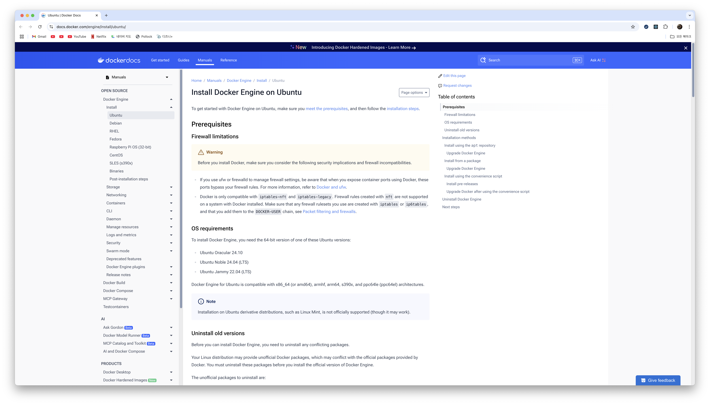

아래 명령어를 통해 기본 설정을 해주고,

```bash
# Add Docker's official GPG key:
sudo apt-get update
sudo apt-get install ca-certificates curl
sudo install -m 0755 -d /etc/apt/keyrings
sudo curl -fsSL https://download.docker.com/linux/ubuntu/gpg -o /etc/apt/keyrings/docker.asc
sudo chmod a+r /etc/apt/keyrings/docker.asc

# Add the repository to Apt sources:
echo \
  "deb [arch=$(dpkg --print-architecture) signed-by=/etc/apt/keyrings/docker.asc] https://download.docker.com/linux/ubuntu \
  $(. /etc/os-release && echo "${UBUNTU_CODENAME:-$VERSION_CODENAME}") stable" | \
  sudo tee /etc/apt/sources.list.d/docker.list > /dev/null
sudo apt-get update
```

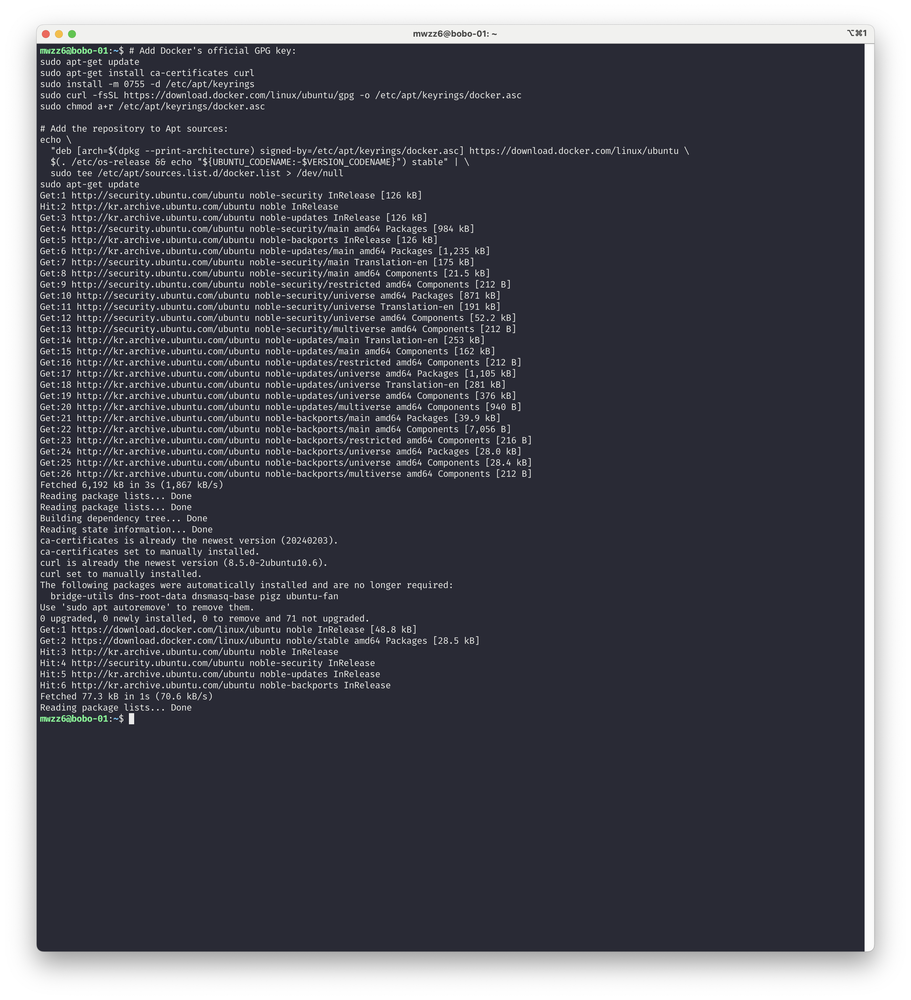

아래 명령어를 통해 `Docker`, `Docker CLI`, `Docker Compose` 등을 설치하면 된다.

```bash
sudo apt-get install docker-ce docker-ce-cli containerd.io docker-buildx-plugin docker-compose-plugin
```

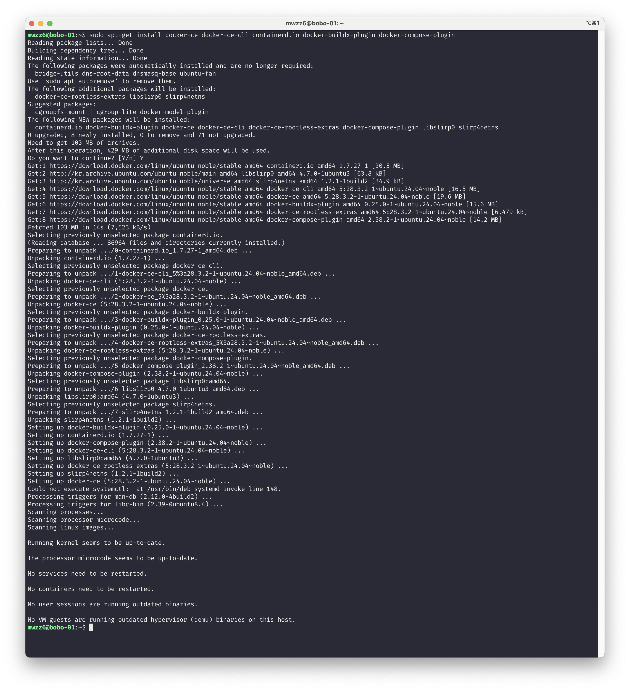

이후 아래 명령어로 `hello-world` 이미지를 불러와서 실행이 잘되면 `Docker` 설치에 성공했다. `sudo docker ps -a`로 `hello-world` 컨테이너가 종료된 것을 확인할 수 있고 `docker -v`, `docker compose version`으로 도커와 도커 컴포즈가 잘 설치된 것도 볼 수 있다.

```bash
sudo docker run hello-world
```

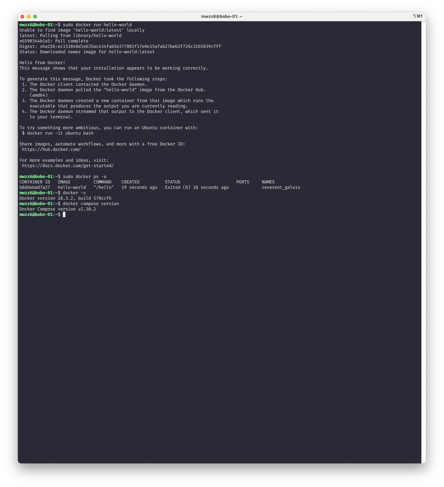

다음으로 `docker` 명령어를 앞으로 자주 사용할 예정이라 `docker`에 대한 그룹 권한을 줘서 `sudo` 없이 명령어를 실행할 수 있게 해줬다. `sudo usermod -aG docker mwzz6` 명령어로 권한을 주고 로그아웃하고 재접속을 하면 이제 `docker` 명령어를 루트 권한 없이 자유롭게 사용할 수 있다.

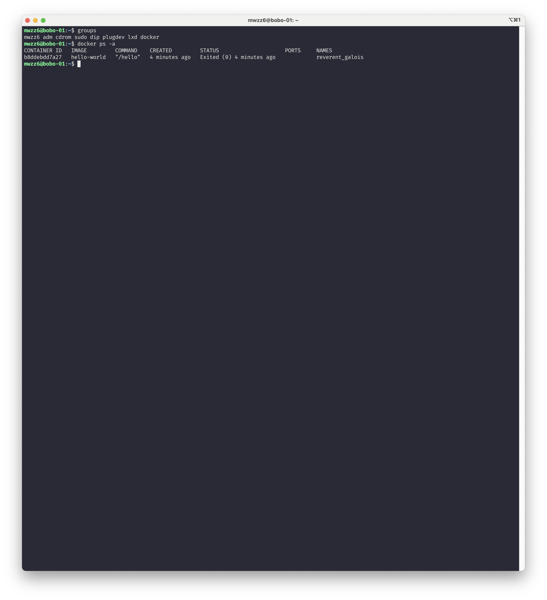

이제 `nginx` 웹 서버를 `Docker`로 띄울 차례이다. `docker run -d --name bobo-nginx -p 80:80 nginx` 명령어로 `nginx` 이미지를 불러와서 `bobo-nginx` 이름으로 홈 서버의 80번 포트에 컨테이너를 띄우고 컨테이너 내부의 80번 포트에 `nginx` 웹 서버를 매핑해줬다. `docker ps`로 컨테이너가 잘 뜬 것을 확인하고 `curl http://localhost:80`을 통해 홈 서버 자신의 80번 포트로 `GET` 요청을 보내면 홈 서버의 80번 포트에 띄운 `bobo-nginx` 컨테이너의 `nginx` 웹 서버에서 `HTML`을 응답으로 받을 수 있다.

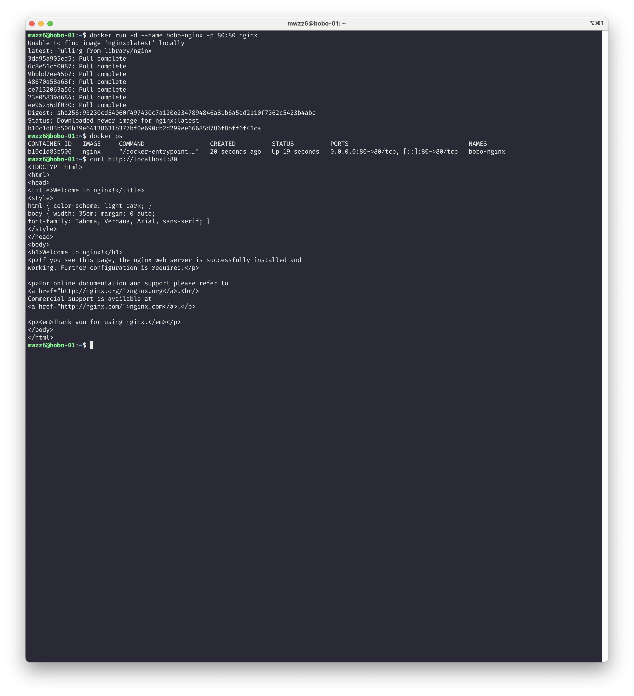

같은 내부 네트워크에 있는 맥북에서도 `curl` 명령어로 `HTML`을 잘 받아서 볼 수 있다.

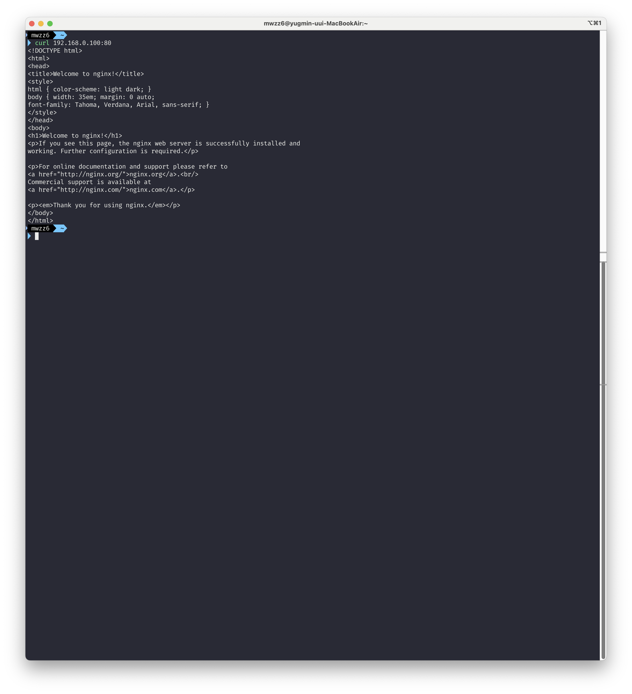

크롬 브라우저에서도 잘 보인다.

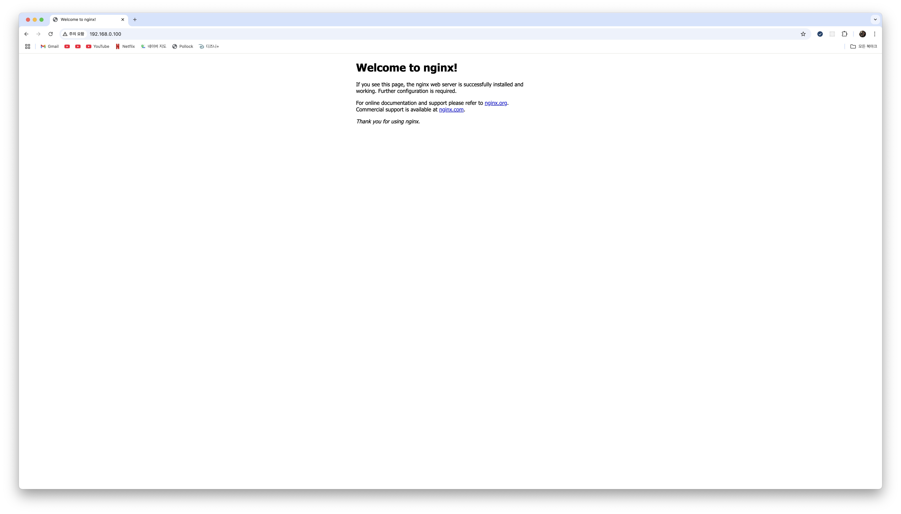

## 포트 포워딩 설정해주기

내부 네트워크에서는 웹 서버에 잘 접속되는 것을 볼 수 있었다. 하지만 실제 호스팅할 서비스는 외부 네트워크의 사용자들도 접근이 가능해야 한다. 사설 IP는 내부 네트워크에서만 유효하므로 외부 네트워크에서 접근하려면 공인 IP를 사용해야하고, 현재 공인 IP는 공유기만 가지고 있다. 외부 네트워크에서 홈 서버의 웹 서버에 접근하려면 외부 네트워크에서 공유기의 공인 IP에 요청을 보내면 이걸 홈 서버로 전달해줘야하고 이 과정에서 포트 포워딩이 필요하다. 공유기의 공인 IP + 80번 포트로 온 요청을 홈 서버의 80번 포트로 전달해주는 포트 포워딩 설정을 통해 외부 네트워크에서 접근 가능하게 웹 서버를 호스팅해보겠다.

공유기 관리자 페이지에서 공인 IP를 간단하게 볼 수 있다.

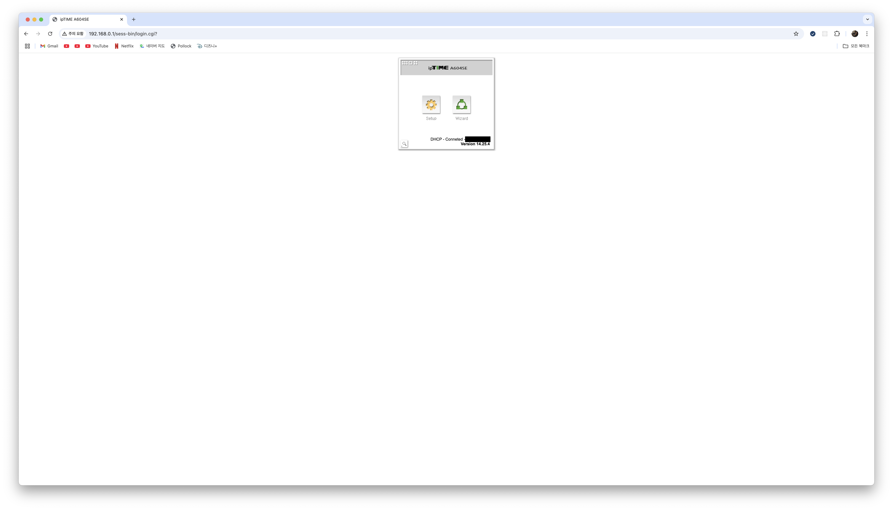

포트 포워딩 설정에서 포트 포워딩할 홈 서버의 사설 IP와 외부 포트의 80번 포트를 내부 포트의 80번 포트로 포트 포워딩 설정을 해주고 저장하면 된다.

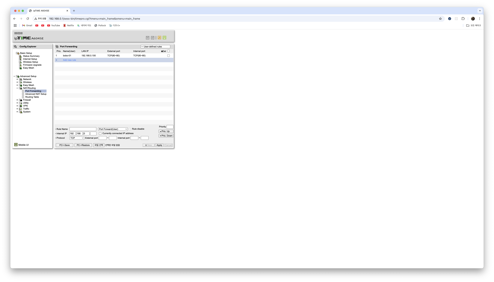

이제 크롬 브라우저에서 공인IP:80으로 홈 서버의 웹 서버에 접속할 수 있다. 브라우저 캐시로 바로 접속이 안될 수 있어서 시크릿 창으로 확인했다. 스마트폰에서 와이파이를 끄고 4g로 접속해도 잘됨을 볼 수 있었다.

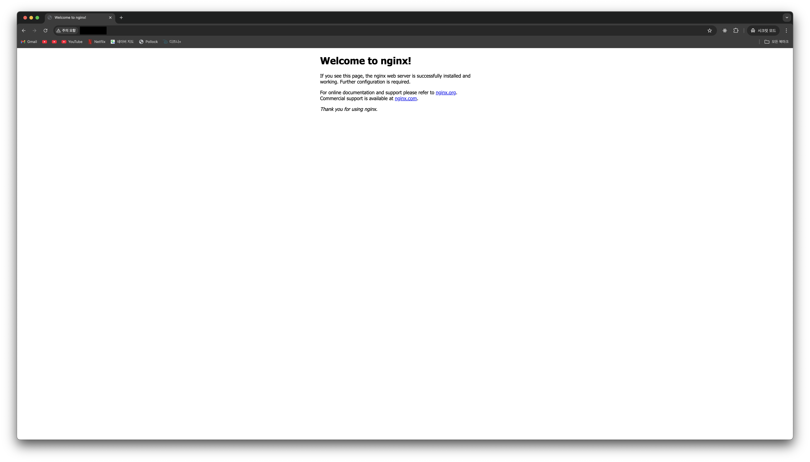

---
