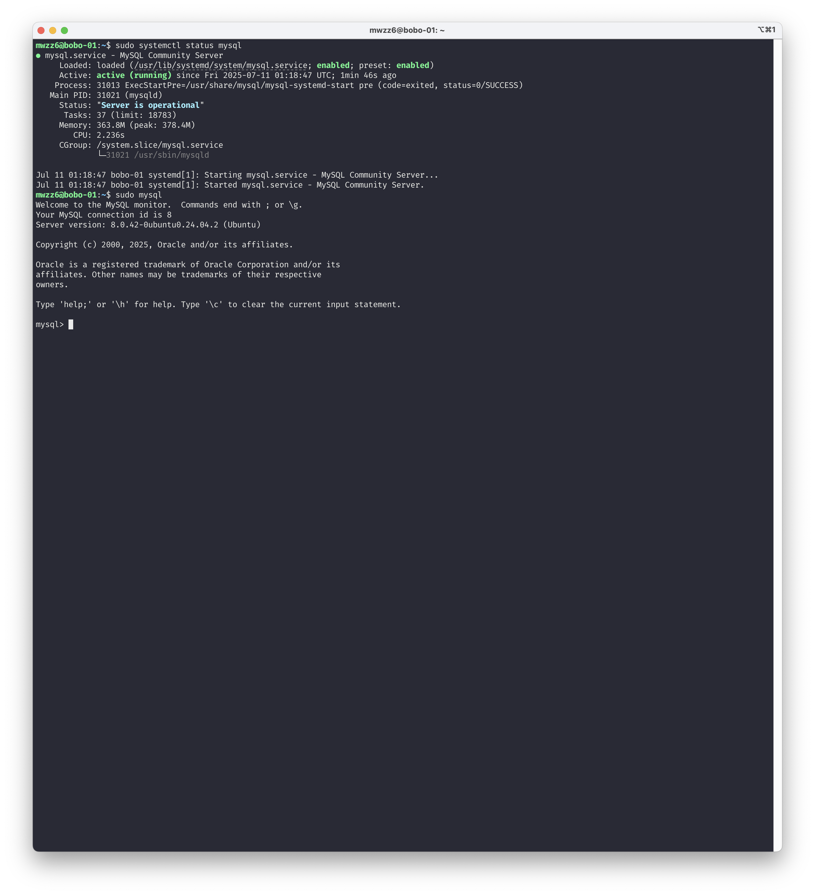
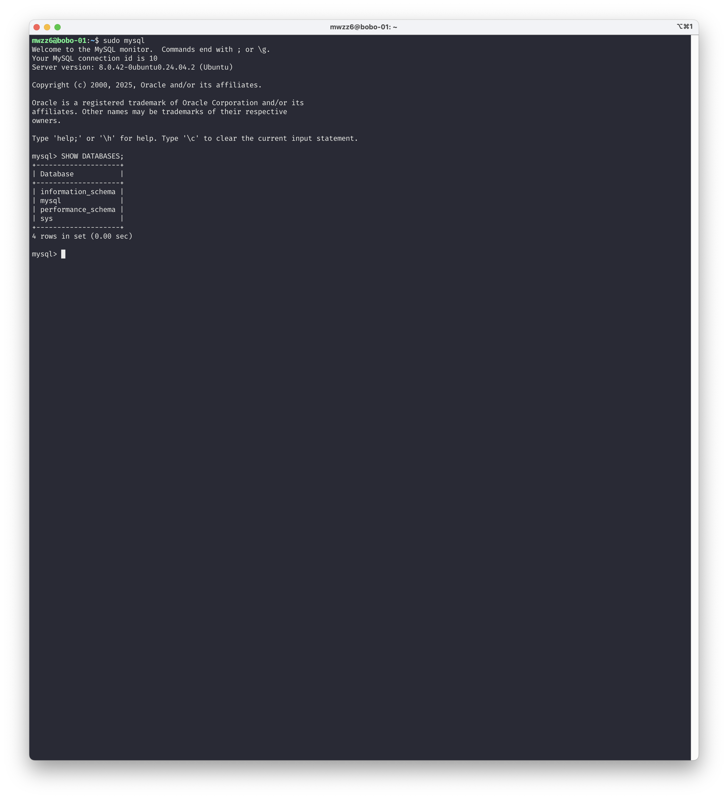
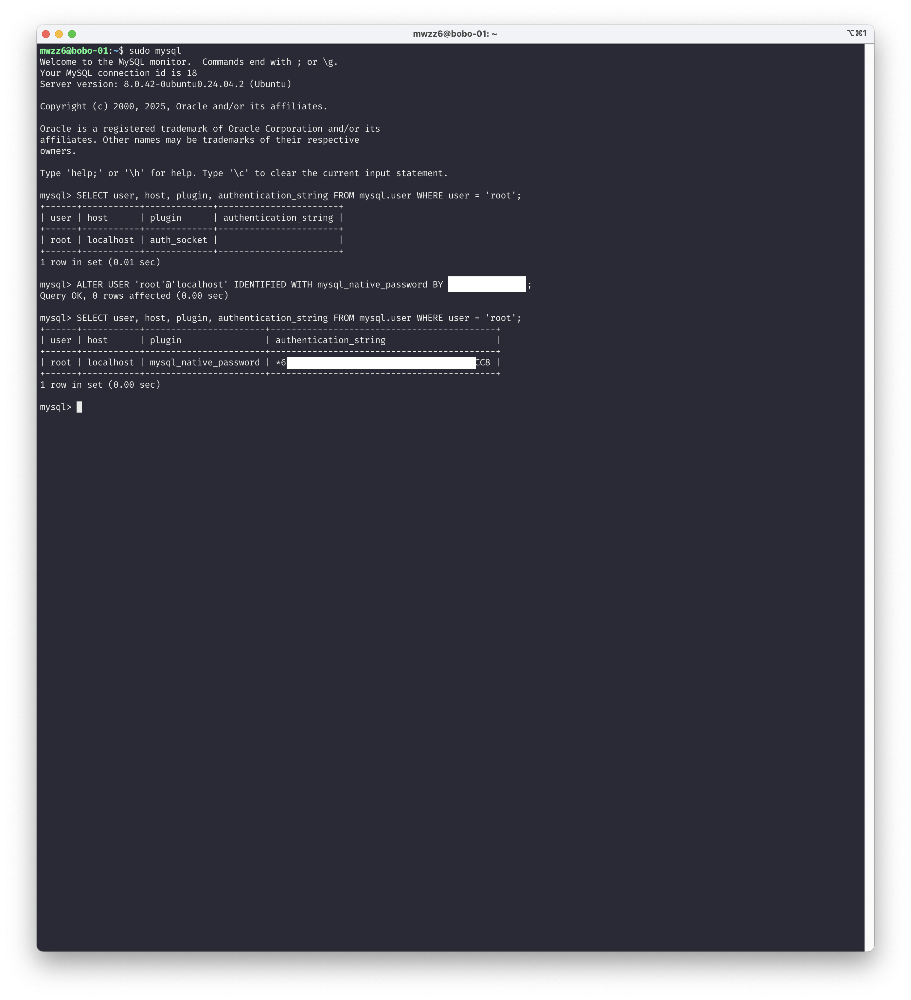
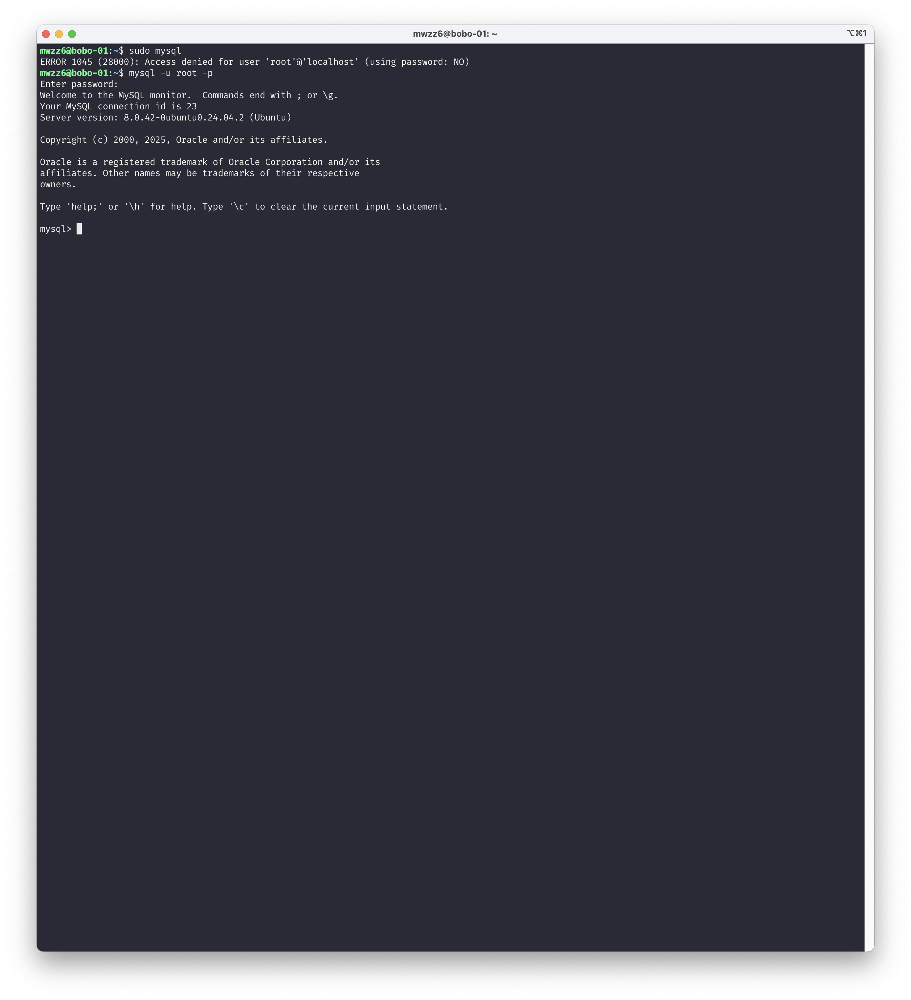
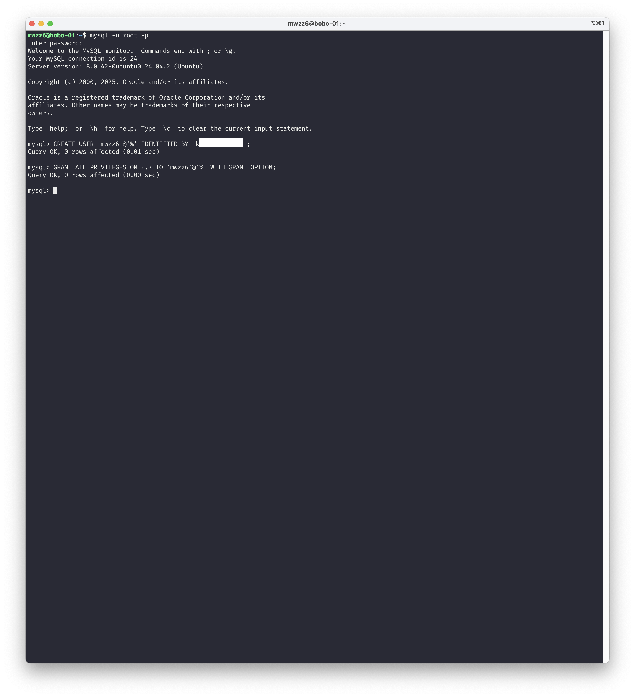
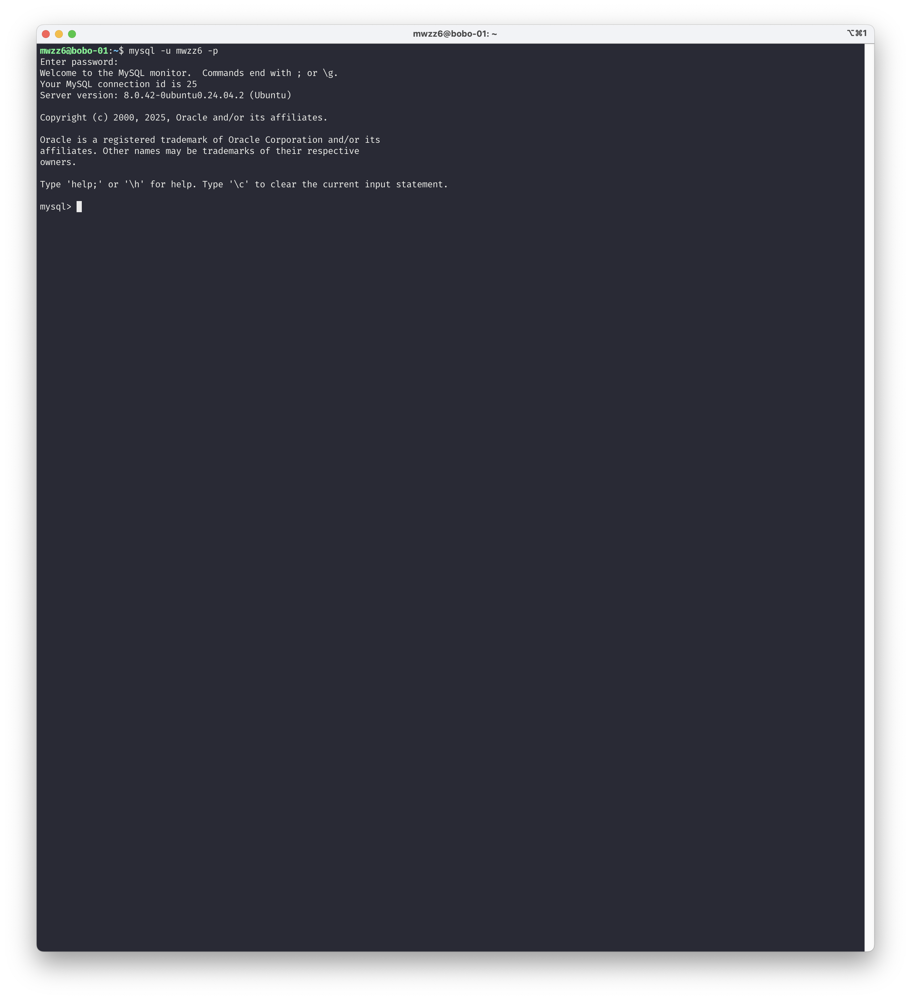
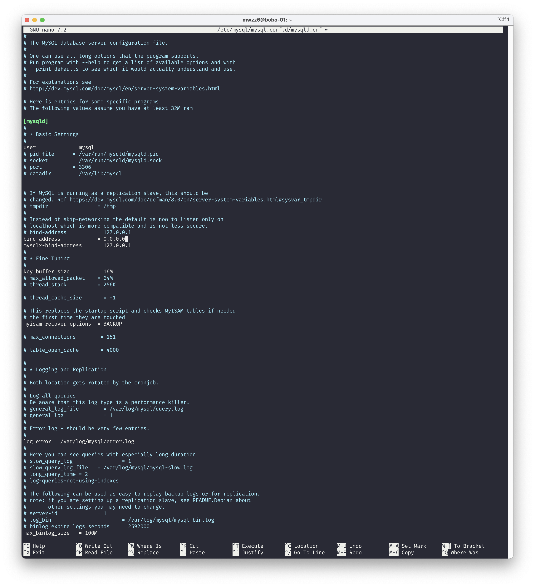
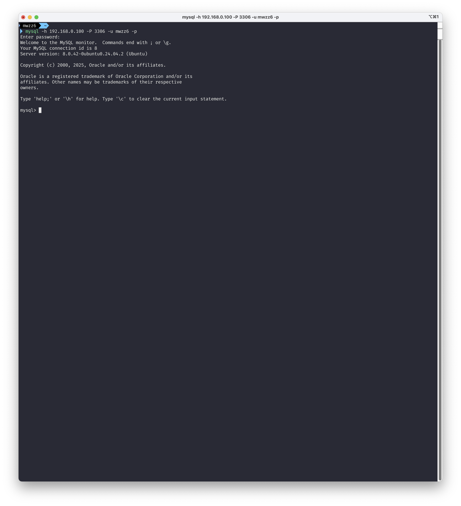
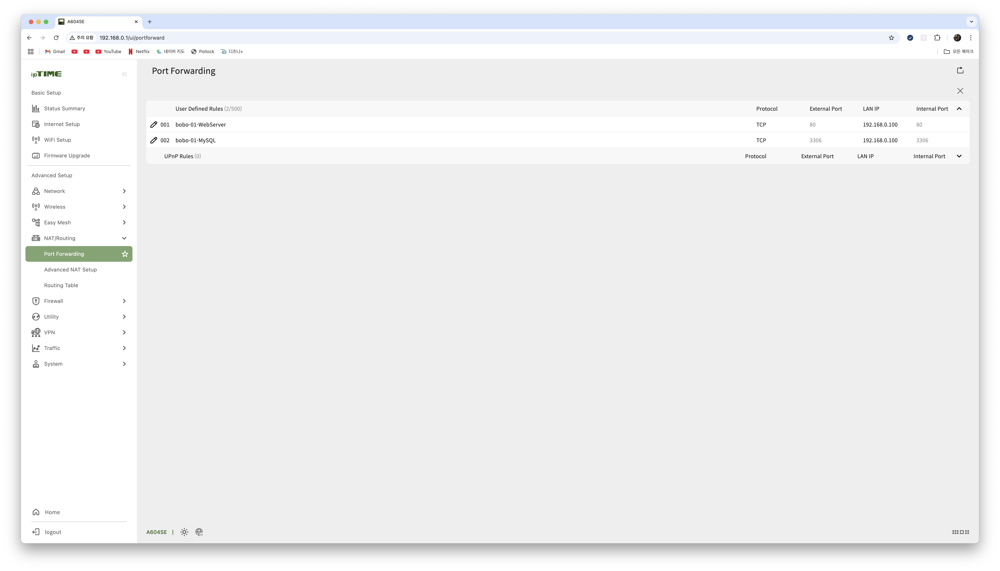
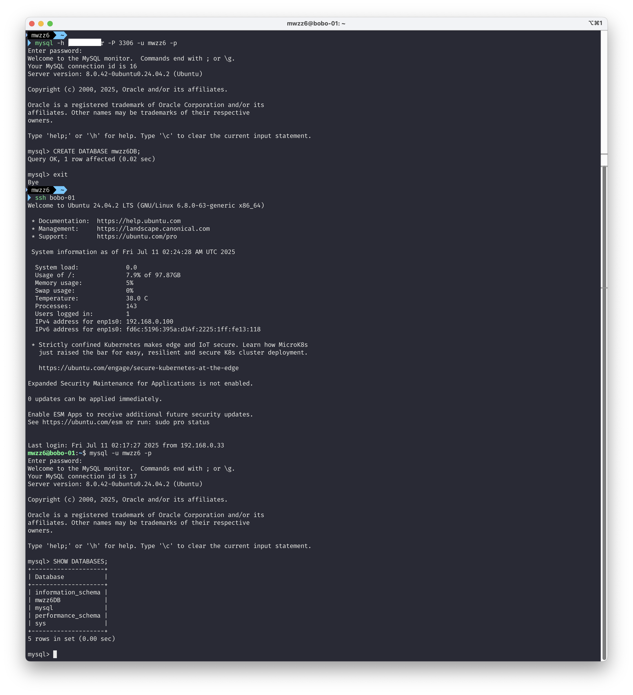

# 홈 서버의 DB에 접속해보기

## 목차

- [소개](#소개)
- [홈 서버에 MySQL 설치하기](#홈-서버에-mysql-설치하기)
- [내부 네트워크에서 홈 서버의 DB에 접속해보기](#내부-네트워크에서-홈-서버의-db에-접속해보기)
- [외부 네트워크에서 홈 서버의 DB에 접속해보기](#외부-네트워크에서-홈-서버의-db에-접속해보기)

---

## 소개

[홈 서버의 웹 서버에 접속해보기](./../2025-07-10/[2025-07-10]%20홈%20서버의%20웹%20서버에%20접속해보기.md)에 이어 이번에는 홈 서버의 DB에 접속해보는 설정을 연습해보려 한다. 실제 서비스 환경에서는 외부에서 접속할 수 있게 DB를 열어두지는 않을 것 같은데 개발 환경에서 여러 팀원이 공유할 수 있는 테스트용 DB를 열어두는 것은 괜찮은 것으로 생각돼서 이번 실습을 통해 향후 팀 단위 프로젝트에서 개발용 테스트 DB를 빠르게 설정할 수 있게 될 것 같다.

---

## 홈 서버에 MySQL 설치하기

DB는 일반적으로 많이 사용하기도 하고 나도 익숙한 RDBMS인 MySQL을 사용하기로 했고, 컨테이너로 띄우면 간단하지만 RDB를 컨테이너로 띄우는 것의 장점이 큰지 잘 모르겠기도 하고 성능면에서 손해가 있을 것으로 생각돼서 홈 서버에 직접 설치하는 방식으로 진행했다.

먼저 `sudo apt update`, `sudo apt upgrade -y` 명령어를 통해 apt 패키지를 최신화해줬다. 이후 `sudo apt install mysql-server` 명령어를 통해 MySQL을 설치할 수 있다.

`sudo systemctl status mysql` 명령어로 MySQL Server가 active (running)으로 나오면 잘 실행 중인 것이고 `sudo mysql` 명령어로 접속해 성공하면 설치가 잘 된 것이다.

다음으로 현재 MySQL 루트 계정으로 비밀번호 없이 접속이 되고 있으므로 루트 계정에 비밀번호를 설정해주고 사용자 계정을 새롭게 만들어서 앞으로 사용자 계정으로 MySQL에 접속해보겠다. MySQL 접속 후 `SELECT user, host, plugin, authentication_string FROM mysql.user WHERE user = 'root';` 명령어를 통해 플러그인이 `auth_socket`으로 설정되어 있어 비밀번호 없이 인증이 되고 있다. `ALTER USER 'root'@'localhost' IDENTIFIED WITH mysql_native_password BY '비밀번호';` 명령어를 입력해주면 설정한 비밀번호 기반 인증으로 변경된다.

이제 `mysql -u root -p`로 비밀번호를 입력해야 인증이 된다.

다음으로 `CREATE USER 'mwzz6'@'%' IDENTIFIED BY '비밀번호';` 명령어를 통해 모든 IP에서 인증 가능한 `mwzz6` 계정과 비밀번호를 설정해주고 `GRANT ALL PRIVILEGES ON *.* TO 'mwzz6'@'%' WITH GRANT OPTION;` 명령어로 모든 DB 권한을 부여해줬다.

이제 `mysql -u mwzz6 -p` 명령어로 사용자 계정으로 접속이 잘되는 것을 볼 수 있었다.

다음으로 `sudo nano /etc/mysql/mysql.conf.d/mysqld.cnf` 명령어를 통해 MySQL 설정 파일을 열어서 `bind-address = 127.0.0.1` 부분을 `bind-address = 0.0.0.0`으로 바꿔주면 모든 IP에서 접속 가능하게 설정할 수 있다. 이후 `sudo systemctl restart mysql` 명령어로 재시작을 해주면 된다.

---

## 내부 네트워크에서 홈 서버의 DB에 접속해보기

지금까지는 `SSH`를 통해 홈 서버 내부에서 MySQL에 접근했다. MySQL에 접속할 때 MySQL 클라이언트에서 `-h, --host` 옵션으로 접속할 MySQL 서버의 호스트를 지정할 수 있고 `-P, --port` 옵션으로 접속할 포트 번호를 지정할 수 있다. 해당 옵션으로 맥북에서 `SSH` 없이 `mysql -h 192.168.0.100 -P 3306 -u mwzz6 -p`로 홈 서버의 DB에 접근할 수 있다.

---

## 외부 네트워크에서 홈 서버의 DB에 접속해보기

외부 네트워크에서 홈 서버의 DB에 접근하려면 웹 서버때와 마찬가지로 외부 네트워크에서 접속하는 끝단인 공유기의 공인 IP에 대해 DB의 포트를 포트포워딩을 해주면 된다. 기존의 DNS까지 활용해서 `도메인 네임:3306`으로 오는 요청에 대해 3306번 포트는 홈 서버의 3306번 포트로 포트 포워딩을 해줘서 외부 네트워크에서도 DB에 접속할 수 있게 해보겠다.

기존 웹 서버때처럼 MySQL의 기본 포트인 3306번 그대로 홈 서버로 포트 포워딩을 해줬다.(공유기 소프트웨어 업데이트를 하니 UI가 더 깔끔해졌다.) MySQL도 네트워크 통신에서 TCP를 사용하니 TCP로 설정해주면 된다.

이후 `mysql -h 도메인 네임 -P 3306 -u mwzz6 -p`으로 MySQL에 접속해서 `CREATE DATABASE mwzz6DB;` 명령어로 `mwzz6DB`라는 데이터베이스를 만들었다. 이후 `SSH`로 다시 접속해서 데이터베이스들을 조회해보면 도메인 네임을 통해 포트 포워딩을 거쳐 MySQL에 만든 데이터베이스가 조회되는 것을 볼 수 있다.

---
